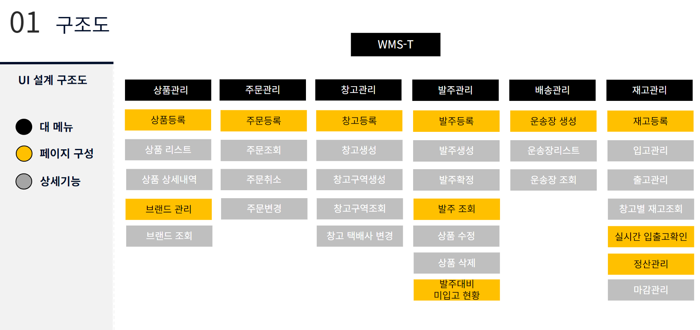
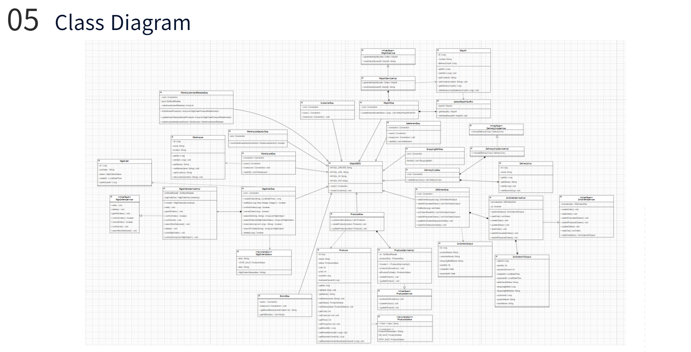
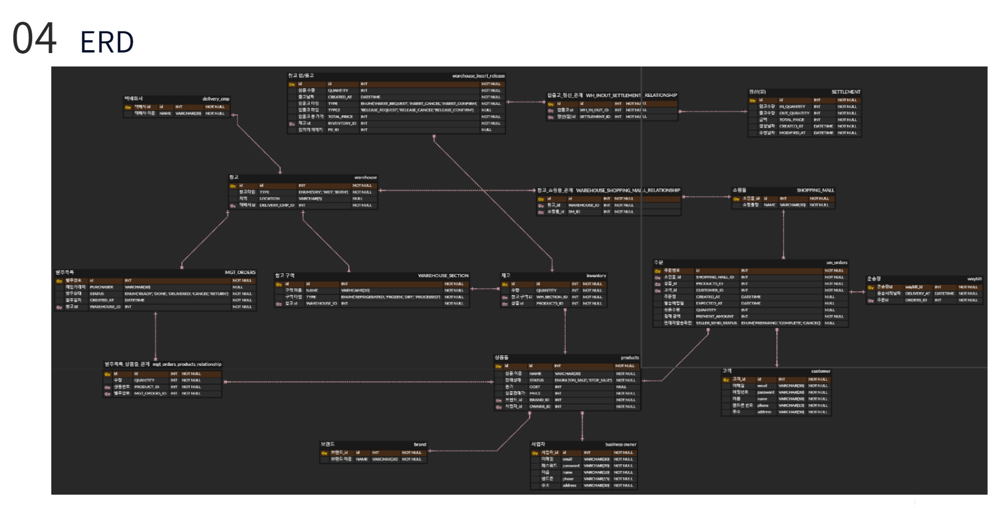
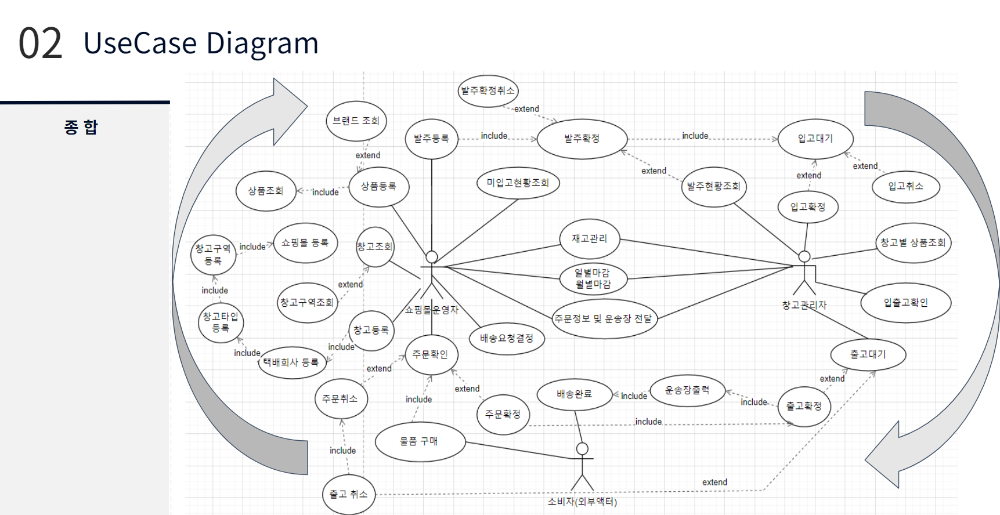

<h2>쇼핑몰 기반 창고관리 시스템(CLI방식)</h2>

<h3>프로젝트 목적</h3>
<ul>
<li>유저는 총관리자, 쇼핑몰관리자, 창고관리자, 주문고객 이렇게 4분류로 나뉜다.</li>
<li>주문고객이 상품을 주문하고 주문 상태에 따라 실시간으로 창고의 입출고 내역을 조회할 수 있다.</li>
<li>CLI방식으로 구현 후, Spring MVC 및 Mybatis적용해서 리펙토링한다. </li>
</ul>

---
<h3>팀원 소개</h3>

| 이름 |                                                                      업무 |
| --- | --- |
| 양성준  | ERD설계,Back-end 개발환경구성, GitHub관리,전체 개발관리  |
| 최문석  | 통합재고관리, 창고관리, 유즈케이스작성  |
| 백정훈 | 발주관리 |
| 문지환 | 상품관리 |
| 이도엽 | 주문관리 |
| 이다혜 | 배송관리 |

---
<h3>주요기능</h3>

- 상품관리 : 상품 등록 및 조회 관련 기능 처리
- 발주관리 : 발주관리 및 발주 관련 기능 처리
- 배송관리 : 배송준비된 상품에 대한 배송 처리
- 주문관리 : 주문 관리 고객 주문 처리 및 배송 연계
- 창고관리 : 발주 상품 입고 및 주문 상품 출고 자동화 관리
- 입/출고관리 : 발주와 주문에 따른 실시간 입/출고관리 (Trigger 적용)
  - 각 입/출고 상태는 대기/취소/확정으로 나뉜다.
- 통합재고관리 : 상품의 입/출고상태에 따라 실시간으로 재고조회 기능 처리

---
### 시연 영상

[여기를 클릭하시면 구현된 영상을 확인 가능합니다](https://www.youtube.com/watch?v=cJ7K8-btvWc)

---
### 사용기술

- JAVA : 전체적인 백엔드 JAVA 객체지향으로 구현
- MySQL : 관계형 데이터베이스로 데이터 저장 및 관리
- JDBC : Java 표준 API를 사용하여 MySQL과 연결하고, 쿼리를 통해 CRUD (Create, Read, Update, Delete) 작업 수행

---
### 주요기능 

---
### Class Diagram

---
### ER Diagram

---
### Usecase

---

### 회고
**[트리거사용]**

재고의 상태를 변경하는데 트리거를 적용해서 사용해보는 경험이 저에게 되게 도움이 많이 되었고 

트리거를 제대로 사용하려면 모든 테이블, 프로젝트의 로직을 다 알고있어야 한다는것을 알게되었습니다. 단순하게 제가 구현한 기능에서 멈추지 않고 정확히 언제 테이블에 데이터가 변경이 되고 그 시점을 파악을 하고 그때 트리거를 적용을 시켜서 데이터가 변화하는것을 직접 눈으로 확인을 해보니 트리거를 왜 사용하고 왜 효율적인지를 알게되는 계기가 되었습니다. 

**[요구사항 중요성 파악]**

요구사항 및 기획을 정확히 알고 있어야 구현을 할때 시간이 절약되고 일을 효율적으로 할 수 있다는 점을 파악했습니다. 그리고 구현해야할 기능이 더 명확해서 필요없는 시간낭비를 하지 않게 되어 좋았습니다. 이미 정해진 구현을 하는 부분에서도 예상하지 못한 변수(여러 오류 및 설계의 문제)들이 발생할 수 있었기에 더욱 더 요구사항 파악 및 기획 부분에서 더블체킹을 하면서 확실하게 인지를 하고 구현을 하는게 좋다라는 것을 느끼게 된 계기가 되었습니다. 

**[직접 코드를 작성하며 어제보다 더 나아지고 있는 실력]**

배움에서 멈추지 않고 직접 코드를 작성하다 보니 왜 프로젝트 경험 중요한지 알게 되었습니다. 단순한 변수명을 정하는 것부터 팀원과의 소통 과정, 구현 능력 이 모든 것을 한 번에 경험할 수 있는 게 바로 프로젝트였습니다. 프로젝트를 진행하다 보니 제가 어느 부분이 부족하고 어느 부분을 숙지하고 있는지 확인할 수 있는 계기가 되었습니다. 저는 이 프로젝트를 진행하면서 데이터의 흐름을 한눈에 파악하는 눈이 부족했습니다. 하지만 부족함은 성장의 기회라고 생각하기 때문에 멈추지 않고 파악하기 위해 코드를 계속 들여다보고 주석 처리하면서 흐름을 파악하려고 하다 보니 점점 익숙해지면서 이것은 어려운 것이 어려움의 영역이 아니라 낮 섬의 영역이라는 것을 알게 되었습니다. 그래서 다음 프로젝트에서는 이제 또 다른 숙제를 해결하면서 더 나은 프로젝트를 진행해 봐야겠다는 생각하게 되었습니다.

